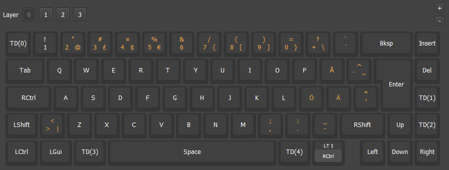
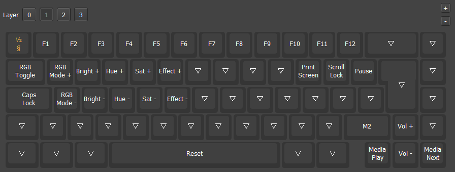
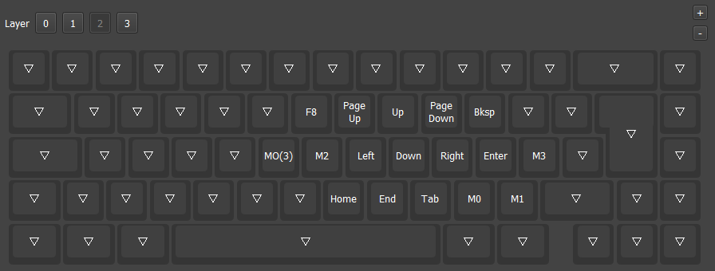
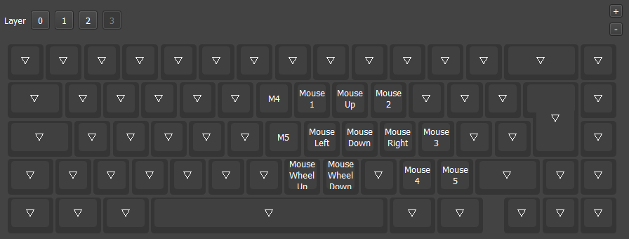

# Glorious GMMK 2 Compact 65% ISO vial-ijkl

A fork of Glorious GMMK 2 Compact 65% ISO keyboard with nordic layout, VIAL-support and customizations:
<ul>
<li>Total 4 layers
<li>Layer 0: Base layer
  <ul>
  <li>Base layer with Tap Dance functions to toggle IJKL to Arrow Keys layer</li>
  <li>With tap dance Home/Page Up and End/Page Down</li>
  </ul>
<li>Layer 1: Backlight controls and function keys on top row
  <ul>
  <li>Fn + P: Print Screen</li>
  <li>Fn + Å: Scroll Lock</li>
  <li>Arrow Keys to media controls
  </ul>
<li>Layer 2: IJKL to Arrow Keys
  <ul>
  <li>G: Layer 3</li>
  </ul>
<li>Layer 3: IJKL to Mouse
<li>Keyboard backlight
  <ul>
  <li>When layers 1 and up are active, white backlight on keys with keymapping. Sync white backlight brightness to keyboard backlight brightness. With white LEDs minimum brightness when keyboard backlight is off.</li>
  <li>When Caps Lock activated: White backlight on Caps Lock key</li>
  <li>When Scroll Lock activated: White backlight on Å-key</li>
  </ul>
<li>Functions with Key Combinations
  <ul>
  <li>Right Control + Caps Lock Key: Toggle Caps Lock</li>
  <li>Alt + 4: Sleep</li>
  <li>Caps Lock Key + Space Bar: Toggle Layer 2</li>
  <li>Tab + Space Bar: Toggle Layer 3</li>
  </ul>
</ul>

<br>
Fork based on Reddit user ptrxyz fork of Vial git repo:<br>

https://www.reddit.com/r/glorious/comments/w5djer/comment/it533dj/
<br>

Link to the Vial repo:<br>
https://drive.google.com/file/d/1U8k3f5xzr2TqhwZ8NwDzYpNBv4OSHxga/view?usp=sharing


## Layer 0 <br>
Base layer<br>

<br>

Tap Dance<br>
| TD | On Tap | On hold | On double tap | On tap + hold |
| -- | -- | -- | -- | -- |
| 0 | § | - | TG(2) | - |
| 1 | Home | - | Page Up | - |
| 2 | End | - | Page Down | - |
| 3 | LAlt | - | TG(2) | - |
| 4 | RGui | AltGr | - | - |

<br>

Key Combos<br>
| Combo | Function |
| -- | -- | 
| Right Control + Caps Lock | Toggle Caps Lock |
| Alt + 4 | Sleep |
| Caps Lock Key + Space | Toggle Layer 2 |
| Tab + Space + Caps Lock | Toggle Layer 3 |

## Layer 1 <br>
Function row, RGB and media controls layer<br>

<br>

Layer 1 macros<br>
| Macro | Action |
| -- | -- |
| 2 | Ctrl + Alt + Tab |

## Layer 2 <br>
IJKL to arrow keys<br>

<br>

Layer 2 macros<br>
| Macro | Action |
| -- | -- |
| 0 | Ctrl + C |
| 1 | Ctrl + V |
| 2 | Ctrl + Alt + Tab |
| 3 | Shift + F10 |
<br>

## Layer 3 <br>
IJKL to mouse<br>

<br>

Layer 3 macros<br>
| Macro | Action |
| -- | -- |
| 4 | Ctrl + Page Up |
| 5 | Ctrl + Page Down |

## Make instructions

Set up QMK build environment. Use Vial repo from Reddit user [ptrxyz](https://www.reddit.com/r/glorious/comments/w5djer/comment/it533dj/).<br>

Create vial-ijkl -folder for GMMK 2 p65 ISO: <br>
```
vial-qmk/keyboards/gmmk/gmmk2/p65/iso/keymaps/vial-ijkl
```

Place following files on vial-ijkl -folder:
```
keymap.c
rules.mk
vial.json
```


Make bin-file:
```
qmk compile -kb gmmk/gmmk2/p65/iso -km vial-ijkl
```

Flash bin file to the keyboard. Use standard flashing procedure.<br>

Open VIAL. <br>

Load saved layout:
```
gmmk_gmmk2_p65_iso_vial-ijkl.vil
```