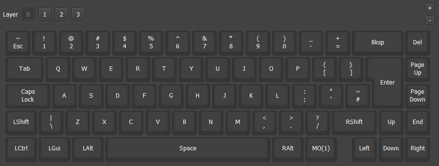
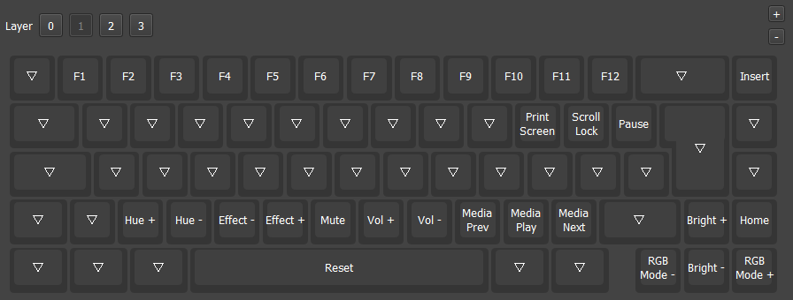

# GMMK 2 65% ISO vial

ISO keyboard layout with VIAL-support.<br>

<br>
Fork based on Reddit user ptrxyz fork of Vial git repo:<br>

https://www.reddit.com/r/glorious/comments/w5djer/comment/it533dj/
<br>

Link to the Vial repo:<br>
https://drive.google.com/file/d/1U8k3f5xzr2TqhwZ8NwDzYpNBv4OSHxga/view?usp=sharing

#### Layer 0 <br>
Base layer<br>

<br>

#### Layer 1 <br>
Function layer<br>

<br>

## Make instructions

Set up QMK build environment. Use Vial repo from Reddit user [ptrxyz](https://www.reddit.com/r/glorious/comments/w5djer/comment/it533dj/).<br>

Create vial-folder for GMMK 2 p65 ISO: <br>
```
vial-qmk/keyboards/gmmk/gmmk2/p65/iso/keymaps/vial
```

Place following files on vial-folder:
```
keymap.c
rules.mk
vial.json
```


Make bin-file:
```
qmk compile -kb gmmk/gmmk2/p65/iso -km vial
```

Flash bin file to the keyboard. Use standard flashing procedure.<br>