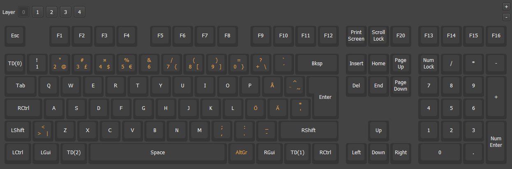
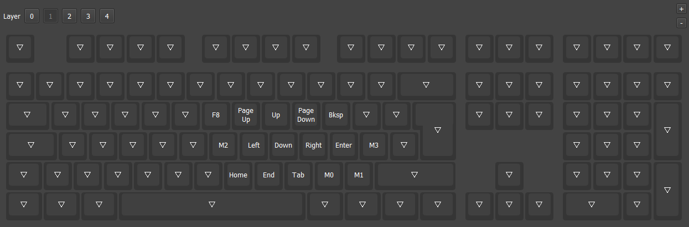
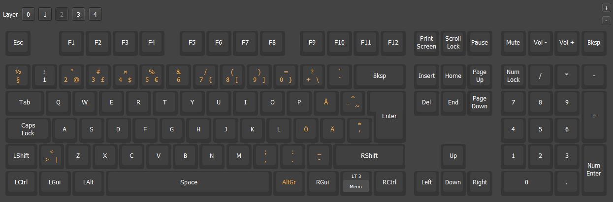
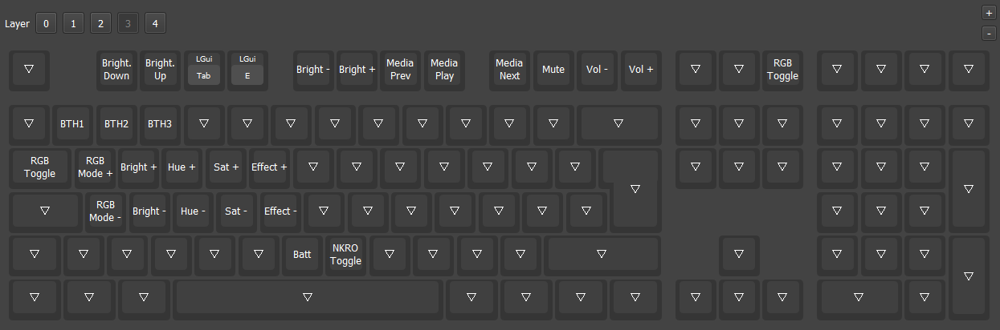
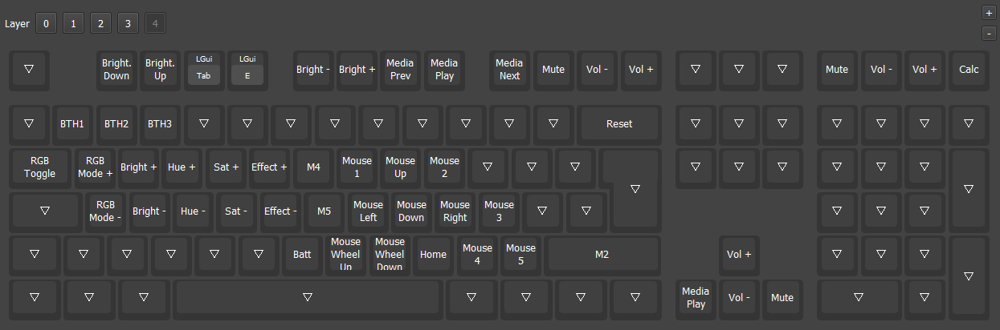

# Keychron K10 Pro ISO RGB vial-ijkl

ISO Nordic layout. VIAL support with customizations:
<ul>
<li> Mac base layer with tap dance functions
  <ul>
  <li>Right Fn double tap: Toggle Mac function-layer</li>
  <li>§ key tap: §</li>
  <li>§ key double tap: Toggle Mac function-layer</li>
  <li>Right Alt double tap: Toggle layer 4 with IJKL to mouse </li>
  <li>Right Fn hold: Toggle Mac function-layer with IJKL to arrow keys</li>
  </ul>
<li>Key combinations
  <ul>
  <li>Caps Lock + Left Control: Toggle Caps Lock</li>
  <li>Caps Lock + Space: Toggle MAC_FN-layer</li>
  <li>Left Shift + Space: Toggle LAYER_4</li>
  <li>Left Alt + 4: Sleep</li>
  </ul>
</li>
<li> Mac function layer: 
  <ul>
  <li>IJKL to arrow keys customization
  </ul>
<li> Retain default functions on Windows layers </li>
<li> Total 5 mappable layers
  <ul>
  <li>Extra layer: LAYER_4
    <ul>
    <li>IJKl to arrow keys</li>
    <li>K10 Pro runs out of space on flash if there are more than 5 layers</li>
    </ul>
  </ul>
<li> Backlight LED customizations
  <ul>
  <li>On MAC_FN, WIN_FN and LAYER_4
    <ul>
    <li>Active layer indication with white LED backlight on keys with key mapping</li>
    <li>If keyboard backlight is close to white, 75% HUE, drop backlight to 50% on keys without keymapping </li>
    </ul>
  <li>When Caps Lock active: White backlight on Caps Lock key</li>
  <li>When Scroll Lock active: White backlight on Scroll Lock key</li>
  </ul>
</ul>
<br>

Fork based on Tymon3310 vial-qmk repo:<br>
https://github.com/tymon3310/vial-qmk/tree/vial-keychron
<br>
<br>

# Layers
#### MAC_BASE - Layer 0 <br>


Tap Dance<br>
| TD | On Tap | On hold | On double tap | On tap + hold |
| -- | -- | -- | -- | -- |
| 0 | § | - | TG(1) | - |
| 1 | Menu | MO(4) | TG(4) | - |
| 2 | Alt | - | TG(4) | - |
<br>

Layer 0 macros<br>
| Macro | Action |
| -- | -- |
| 4 | Ctrl + Page Up |
| 5 | Ctrl + Page Down |
<br>

Key Combos<br>
| Combo | Function |
| -- | -- | 
| Right Control + Caps Lock | Toggle Caps Lock |
| Caps Lock Key + Space | Toggle Layer 1 |
| Tab + Space | Toggle Layer 4 |
| Alt + 4 | Sleep |

<br>

#### MAC_FN - Layer 1 <br>

IJKL to arrow keys layer



Layer 1 macros<br>
| Macro | Action |
| -- | -- |
| 0 | Ctrl + C |
| 1 | Ctrl + V |
| 2 | Ctrl + Alt + Tab |
| 3 | Shift + F10 |
<br>

#### WIN_BASE - Layer 2 <br>
Retain default layout on Windows base layer<br>

<br>

#### WIN_FN - Layer 3 <br>
Retain default layout Windows function layer<br>


#### Layer 4<br>

Special functions layer:<br>
<ul>
<li>IJKL to mouse cursor movement</li>
<li>Function row media controls</li>
<li>QWERT, ASDFG: backlight controls</li>
<li>Arrow keys media control</li>
</ul>



Layer 4 macros<br>
| Macro | Action |
| -- | -- |
| 3 | Shift + F10 |
| 4 | Ctrl + Page Up |
| 5 | Ctrl + Page Down |
<br>

## Make instructions

Set up QMK build environment. Use repo: [Tymon3310/vial-keychron](https://github.com/Tymon3310/vial-qmk/tree/vial-keychronn)<br>

Create vial-ijkl -folder for Keychron K10 Pro ISO RGB: <br>
```
keychron-vial/vial-qmk/keyboards/keychron/k10_pro/iso/rgb/keymaps/vial-ijkl
```

Place following files on vial-ijkl -folder:
```
config.h
keymap.c
rules.mk
vial.json
```

Make bin-file:
```
qmk compile -kb keychron/k10_pro/iso/rgb -km vial-ijkl
```

Flash bin file to keyboard. Follow the standard flashing prodecure for K10 Pro.<br>

Open VIAL. <br>

Load saved layout:
```
keychron_k10_pro_iso_rgb_vial-ijkl.vil
```