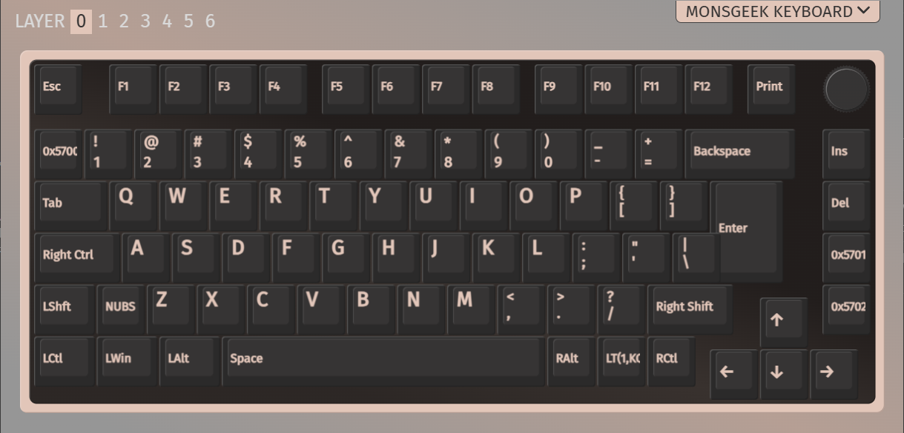
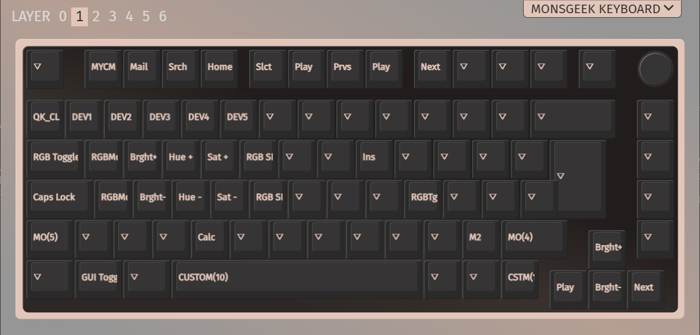
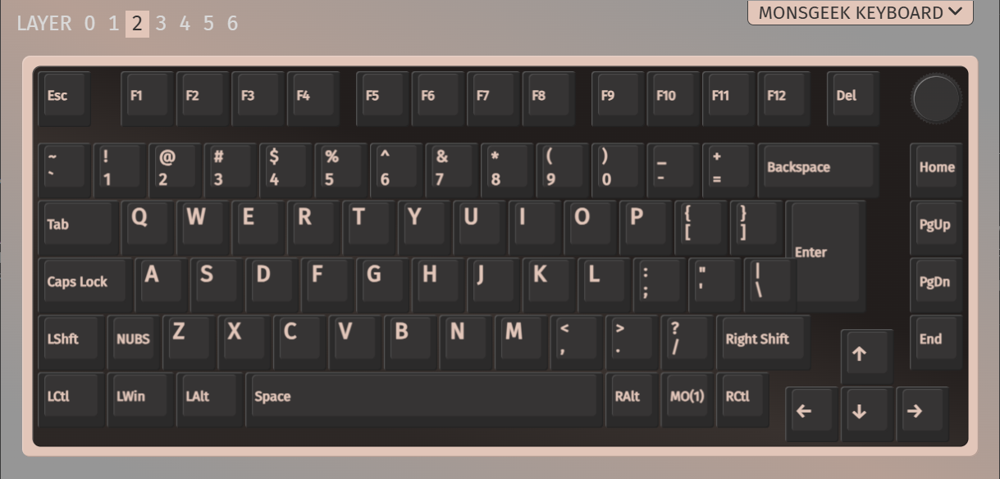
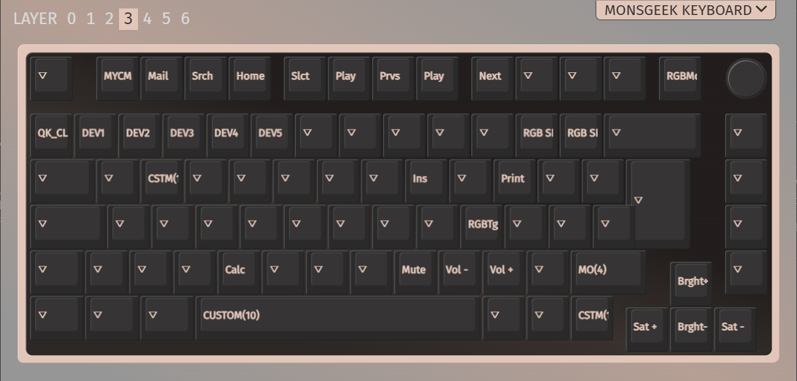
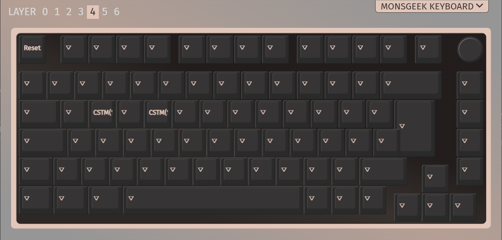
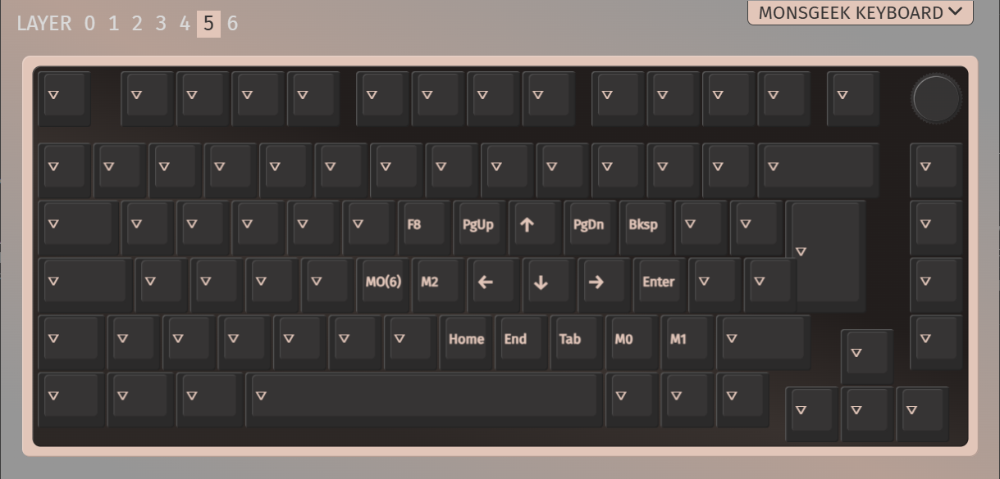
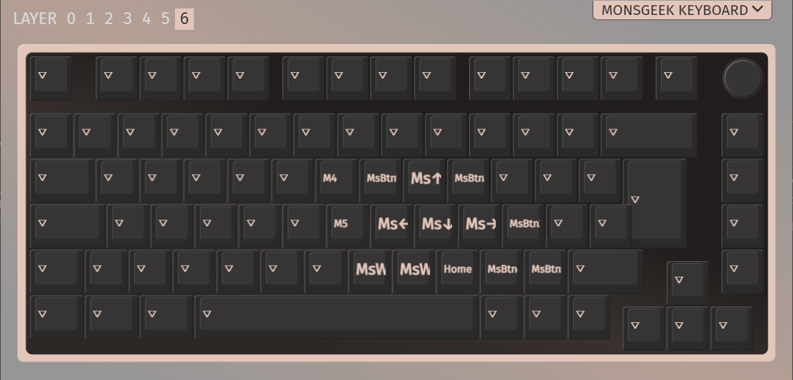

# MonsGeek M1 V5 ISO via-ijkl

ISO Nordic layout. VIA support with customizations:
<ul>
<li>Total 7 mappable layers
  <ul>
  <li>Layer 5: IJKL to Arrow Keys</li>
  <li>Layer 6: IJKL to Mouse</li>
  </ul>
<li>Right side column keys</li>
  <ul>
  <li>Home -> Insert</li>
  <li>Page Up -> Delete</li>
  <li>Page Down -> Home / Double tap: Page Up</li>
  <li>End -> End / Double tap: Page Down</li>
  </ul>
<li>via-ijkl/keymap.c mods
  <ul>
  <li>§ key tap: §</li>
  <li>§ key double tap: Toggle layer 5: IJKL to arrow keys</li>
  <li>Home key tap: Home</li>
  <li>Home key double tap: Page Up</li>
  <li>End key tap: End</li>
  <li>End key double tap: Page Down</li>
  </ul>
<li> m1_v5_uk.c key tap combo mods
  <ul>
  <li>Right Control + Left Control: Toggle Capsloc</li>
  <li>Right Control + Capslock: Toggle Capsloc</li>
  <li>Capslock + Space: Toggle Layer 5 - IJKL to Arrow Keys</li>
  <li>Right Shift + Space: Toggle Layer 6 - IJKL to Mouse</li>
  </ul>
<li>config.h mods
  <ul>
  <li>Remapped Bluetooth, 2,4 GHz and USB-connection indication LEDSs to keys 1,2,3,4 and 5</li>
  </ul>
</ul>
<br>
Fork based on MonsGeek repo with wireless -branch:<br>
https://github.com/MonsGeek/qmk_firmware.git

<br>

# Layers
### _BL - Layer 0 <br>
Base Windows layer with mods<br>


<br>

Tap dance key functions on keymaps/via-ijkl/keymap.c

| Function | On Tap  | On Double Tap |
| -- | -- | -- |
|  TD_GRV_TOGGLE | § | Toggle layer 5 |
|  TD_HOME_PGUP | Home | Page Up |
|  TD_GRV_TOGGLE | End | Page Down |

<br>
<br>

Key Tap Combos on m1_v5_uk.c<br>

| Combo | Function |
| -- | -- | 
| Left Control + Caps Lock | Toggle Caps Lock |
| Caps Lock Key + Space | Toggle Layer 5 |
| LShift + Space | Toggle Layer 6 |

<br>
<br>

Key Combos on VIA-keymap<br>
| Combo | Function |
| -- | -- | 
| Fn + Volume Wheel | Sleep |

<br>

### _FL - Layer 1 <br>
Windows Function layer with mods


<ul>
  <li>Remapped backlight control keys to QWERTY, ASDFG</li>
  <li>Media control to right and left keys</li>
</ul>
<br>
Remapped Bluetooth, 2.4 GHz and Wired connection activation keys <br>

| Key | Function | VIA keycode |
| -- | -- | -- |
| 1 | Bluetooth Host 1 | DEV1 |
| 2 | Bluetooth Host 2 | DEV2 |
| 3 | Bluetooth Host 3 | DEV3 |
| 4 | 2,4 GHz | DEV4 |
| 5 | Wired | DEV5 |

<br>

Special functions<br>
| Key | Function | VIA keycode | keymap.c keycode |
| -- | -- | -- | -- |
| Fn + Left WIN | Disable WIN-key | TOGGLE GUI | MAGIC_TOGGLE_GUI |
| Fn + Space | Display battery level on wireless connections | CUSTOM(10) | HS_BATQ |
| Fn + Right Control | Revert Ctrl into Menu Key | HS_CT_A | HS_CT_A |
| Fn + § | Clear Eeprom | QK_CLEAR_EEEPROM | EE_CLR |

<br>

Layer 1 macros<br>
| Macro | Action |
| -- | -- |
| 2 | Ctrl + Alt + Tab |
<br>

<br>

### _MBL - Layer 2 <br>
Defalut MAC-layer to Default Windows-layer


<br>


### _MBL - Layer 3 <br>
Function MAC-layer to Default Windows Function Layer


<br>

### _FBL - Layer 4 <br>
Function MAC-layer


Special functions<br>
| Key | Function | VIA keycode | keymap.c keycode |
| -- | -- | -- | -- |
| Fn + Right Shift + W | Swap WASD with Arrow Keys | Custom(11) | HS_DIR |
| Fn + Right Shift + R | Bluetooth Test | Custom(12) | BT_TEST |
| Fn + Right Shift + ESC | Enter Bootloader | RESET | QK_BOOT |

<br>

### _FCL - Layer 5 <br>
IJKL to Arrow Keys


Layer 5 macros<br>
| Macro | Action |
| -- | -- |
| 0 | Ctrl + C |
| 1 | Ctrl + V |
| 2 | Ctrl + Alt + Tab |
| 3 | Shift + F10 |
<br>

<br>

### _FCL - Layer 6 <br>
IJKL to Mouse


Layer 6 macros<br>
| Macro | Action |
| -- | -- |
| 0 | Ctrl + C |
| 1 | Ctrl + V |
| 4 | Ctrl + Page Up |
| 5 | Ctrl + Page Down |
<br>


## Make instructions

Set up QMK build environment. Use MonsGeek -repo with wireless -branch: <br>
[MonsGeek/qmk_firmware](https://github.com/MonsGeek/qmk_firmware.git)<br>

Folder for M1 V5 UK -files:<br>
```
qmk_firmware/keyboards/monsgeek/m1_v5/m1_v5_uk/
```

Place following files on monsgeek/m1_v5/m1_v5_uk/ folder:
```
monsgeek/m1_v5/m1_v5_uk/
├── keymaps/via-ijkl/keymap.c
├── keymaps/via-ijkl/rules.mk
├── config.h
└── m1_v5_uk.c
```


Make bin-file:
```
qmk compile -kb monsgeek/m1_v5/m1_v5_uk -km via-ijkl
```

Flash bin file to keyboard. Follow the standard flashing prodecure for M1 V5.<br>

Open VIA. <br>

Load saved layout:
```
via/monsgeek_m1_v5_uk-via-ijkl.json
```

Set backlight off, enable layer 5 and 6 indication<br>
<ul>
  <li>Set keyboard mode switch to Windows, lower position</li>
  <li>Open VIA website usevia.app</li>
  <li>Set Backlight to Solid Color</li>
  <li>Active previus backlight mode: Fn + Q</li>
  <li>Backlight brightness may be set with Fn + W and S</li>
</ul>