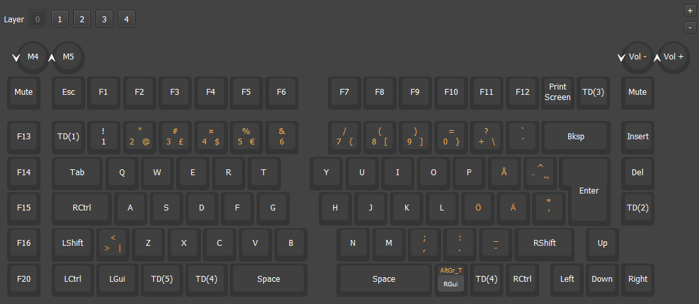

# QMK-keyboard layouts

Collection of keyboard layouts

## Keychron Q11 SO vial-ijkl

A fork of Keychron Q11 with ISO layout with VIAL support and customizations:
<ul>
<li> Mac base layer with tap dance functions
  <ul>
  <li>Right Fn double tap: Toggle Mac function-layer</li>
  <li>§ key tap: §</li>
  <li>§ key double tap: Toggle Mac function-layer</li>
  <li>Right Alt doulbe tap: Toggle layer 4</li>
  <li>Left Fn hold: Toggle Mac function-layer</li>
  </ul>
<li> Mac function layer: 
  <ul>
  <li>IJKL to arrow keys customization
  </ul>
<li> Retain default functions on Windows layers </li>
<li> Total 5 mappable layers
  <ul>
  <li>Extra layer: layer_4
    <ul>
    <li>IJKl to arrow keys</li>
    </ul>
  </ul>
<li> Active layer indication on M1-M5 (F13-F20) keys with white backlight with keymap.c code
  <ul>
  <li>Layer 1 active, white backlight on key M2 / F14</li>
  <li>Layer 2 active, white backlight on key M3 / F16</li>
  <li>Layer 4 active, white backlight on key M1 / F13</li>
  <li>Custom QMK keycode on keymap.c: TOGGLE_LAYER_LEDS</li>
  </ul>
<li>Volume Wheel on Mac base layer
  <ul>
  <li> Fn + Right Volume Wheel press: Sleep </li>
  <li> Left volume wheel scroll: Ctrl + Page Up / Ctrl + Page Down</li>
  </ul>
<li> Left Control + Caps Lock Tap: Toggle Caps Lock
  <ul>
  <li>When Caps Lock active: White backlight on Caps Lock key
  </ul>
</ul>
 

Fork based on Tymon3310 vial-qmk repo: 
https://github.com/Tymon3310/vial-qmk/tree/vial-updated-keychron
